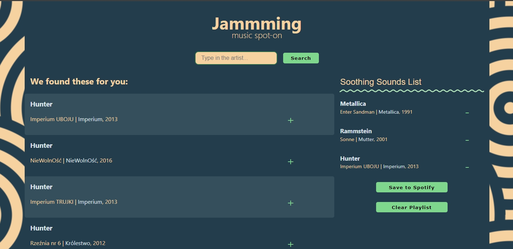

# Jammming - Music Spot-On
This project started as a Codecademy exercise, and I've put in significant effort to enhance its functionality by exploring solutions on forums, watching tutorials on YouTube, and seeking assistance from ChatGPT.

## Project Overview
Jammming is a web application that allows users to search for their favourite artists, view their top tracks, and create playlists. The application leverages the Spotify API for artist and track information.

## Features
- **Spotify Integration**: Utilizes the Spotify API to fetch artist details and top tracks.
- **Search and Create Playlists:** Users can search for artists, add tracks to their playlist, and save playlists to their Spotify account.
- **Persistent Storage:** Playlists are stored locally, allowing users to revisit their created playlists even after closing and reopening the application.

## Getting Started
To run this project locally, you can follow these steps:

1. Clone the repository to your local machine.
2. Install the necessary dependencies using **`npm install`**.
3. Set up a Spotify API key and update the relevant credentials in the code.
4. Start the development server using **`npm start`**.

## Possible Improvements
- **Hide API Key:** Implement a server to securely store and handle the Spotify API key.
- **Deploy the Site:** Make the application accessible online to showcase its functionality.
- **Expand Search Criteria:** Enhance the search functionality to include genres, albums, and more.
- **Tailwind CSS Integration:** Consider rewriting the CSS in Tailwind CSS for improved maintainability and efficiency.

## Code Level
The code showcases a solid understanding of React, asynchronous operations using **`async/await`**, and state management with React hooks. The implementation of a Spotify integration demonstrates intermediate-level skills.

## Acknowledgments
- Codecademy for the initial project structure and a sneak peek at a solution file, which saved my mental health while figuring out the logic for a refresh token.
- The developer community on forums and YouTube for valuable insights and solutions.

